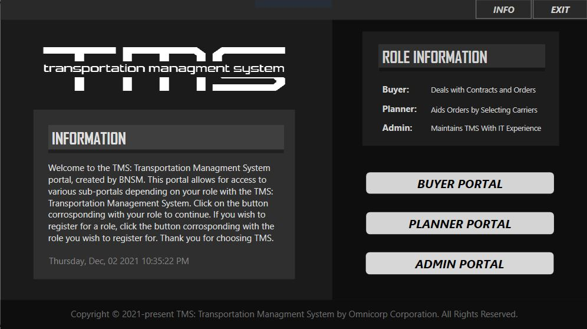
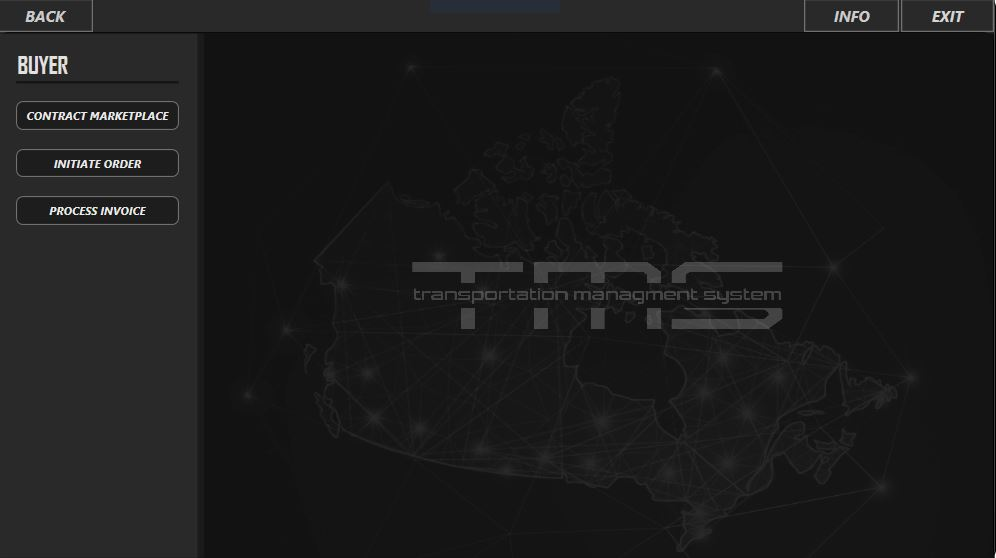
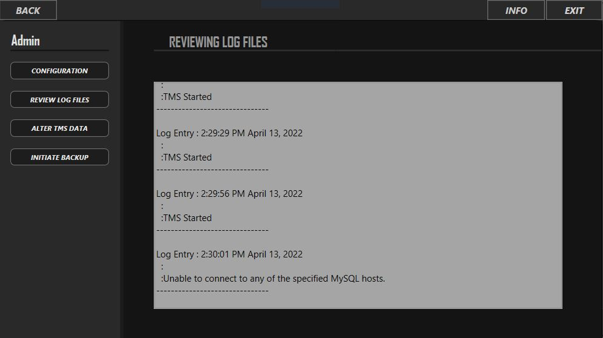

# Software Quality - Transportation Management System

The Transportation Managment System is an application designed to
communicate with MySQL databases and provide infromation regarding
the transportation of certain products. The program is supposed to
be able to allow a user to select the information from  the database
through the UI of WPF and then calculate information regarding cost,
distance of the travel, among other important things. 

	Landing Page for the TMS application. Allows user to select and
	enter either the Buyer Portal, Admin Portal, or Admin Portal.
  

  

  

